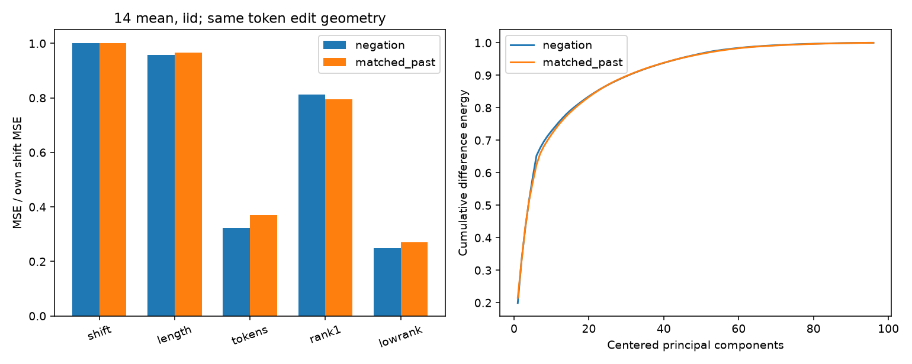
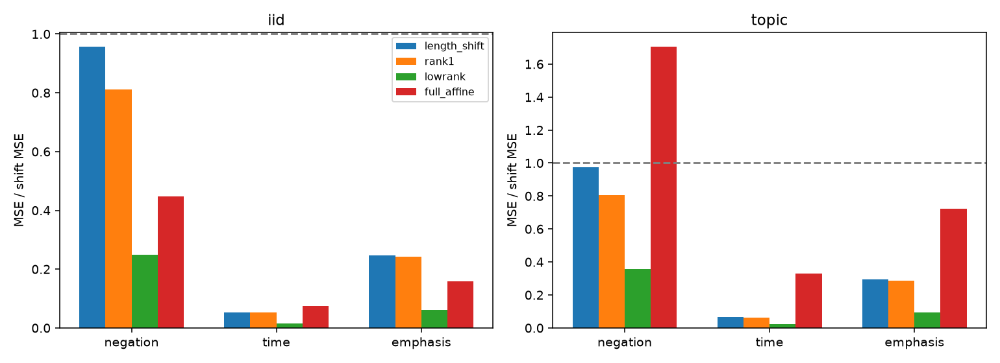
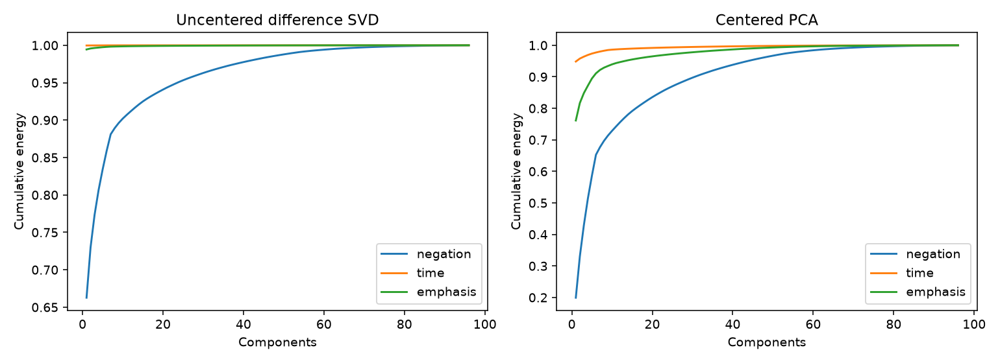
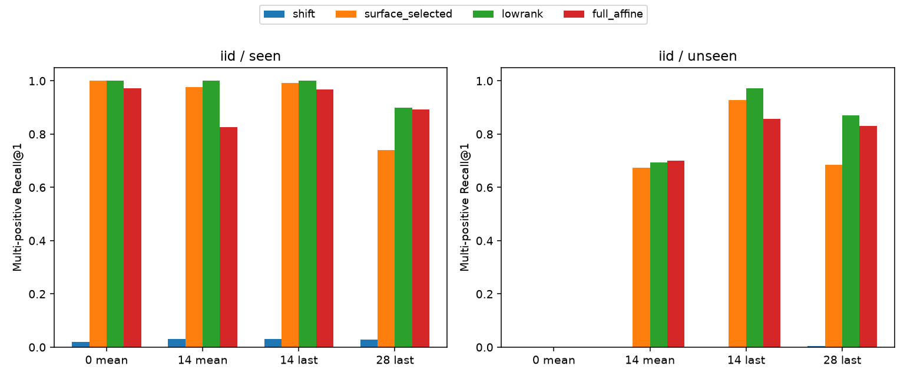
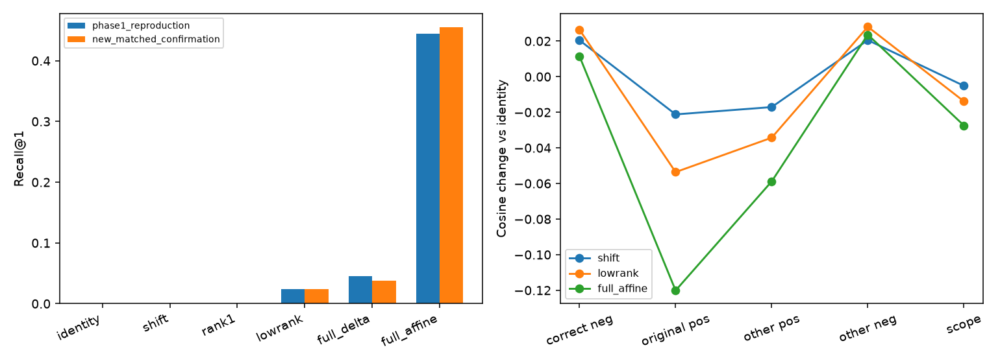
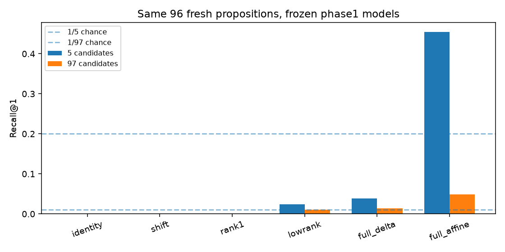

# 第二阶段研究报告：控制表面编辑后，否定结构还能泛化吗？

本研究实际完成于2026-09-28。基于第一阶段本地提交`9d07c6f`，新增内容全部在`phase2/`；第一阶段文件通过SHA256逐项核验保持不变。模型仍是Qwen2.5-7B-Instruct，revision `a09a35458c702b33eeacc393d103063234e8bc28`。所有数值来自实际运行，无模拟补数。数据仍未取得独立真人金标准，因此语义解释保留探索性性质。

## 五个问题的直接回答

1. **第一阶段秩1收益有相当部分被已测试表面机制覆盖，但不能给出“语义占比”。** 旧第14层mean的长度条件平移覆盖了相对固定平移之rank1 MSE收益的66.77%（iid）、76.14%（topic）、87.63%（template）。这是两个方法改善量的比值，不是因果或独立方差分解。第0层实际token embedding的解析恒等式达到浮点精度；它依赖目标文本，只验证机制。深层未被这些基线覆盖的部分可能含词汇上下文化、位置、时体、容量差异，不能命名为纯语义。
2. **非否定编辑也有低维结构；严格token匹配后，与否定的形状和收益很接近。** 在第14层mean、iid中，否定的平移/低秩MSE为0.013519/0.003375，“V了→曾V”非否定控制为0.010464/0.002832。两种编辑在384条源句上完全匹配源/目标token长度、总编辑数、起始位置。第1中心化主成分分别仅解释19.93%/21.54%，与第一阶段98.41%显著不同。这反对把第一阶段强秩1结构当作否定专属结构，也不意味着所有低秩关系都只是长度差。
3. **在本次受控、多正例且留出“不曾/从未”表达族的任务中，出现了跨表达迁移，但不是通用算子。** 第14层mean低秩在表达单轴留出上R@1为69.44%，新主题加新表达66.49%，新谓词族加新表达33.33%，联合留出33.33%。主测试28候选/2正例，机会水平7.14%。量词、情态、范围挑战仍大量失败。
4. **相对第0层有明显任务收益；相对源token表面预测器，预指定主比较没有稳定额外优势。** 主测试14层mean低秩69.44%，第0层mean为0%；但源token预测器已有67.36%。差2.08个百分点，95%区间[−3.48,8.68]，97.5%区间[−4.51,10.07]，未支持主假设。区间并未排除中等正收益，不能据此断言二者等价。14层last和28层last的探索性比较有更大正差，但不能替换未获支持的主结果。
5. **末层完整仿射的五候选优势在独立新命题上重现，且强烈依赖候选和几何。** 原44.44%在新96句上为45.49%；同批句子扩到97候选后为4.86%。主要间隔改善来自降低原肯定的相似度，而非更准确地到达正确目标。不能把局部复现升级成可靠的开放式语义否定检索。

## 第一阶段核对、协议和执行

已阅读第一阶段REPORT、PROTOCOL、实际CSV、解析降秩实现、提取与长度基线。第一阶段14层mean的topic秩1 MSE0.282578、rank32 MSE0.276553；第0层mean低秩在topic相对恒等改善97.05%；末层last完整仿射joint R@1为44.44%。C分支用原缓存、原训练bootstrap和原选定超参重新拟合6种方法×3seed，MSE/R@1/MRR与原记录的最大差为8.88e-16。

[PHASE2_PROTOCOL.md](PHASE2_PROTOCOL.md)在第二阶段测试模型结果生成前冻结，hash与时间见[protocol_freeze.json](protocol_freeze.json)。唯一主要终点：14层mean共享低秩减dev选定表面基线，在iid/未见表达候选池上的多正例R@1差。C新五候选full_affine减lowrank为独立次要复核。报告95%区间，并为这两个预指定比较保守提供97.5%区间；其余多层/分布/消融均探索性，没有在筛选后换主层。

数据/代码检查后修改了固定人名划分：用topic×谓词×人名索引轮转，使四个人名都出现在train/dev/iid，减少新主语词汇这一额外混淆。原A控制的token匹配不足时，另行冻结严格匹配非否定补充；这一步只依据token统计，没有查看第二阶段性能，不改B/C或主终点。C的97候选组成消融也在未读新C性能前固定为探索性。完整记录见[DEVIATIONS.md](DEVIATIONS.md)，未覆盖原协议。

模型固定、裸文本、不加special/chat token、FP32推理、关闭TF32、float64拟合；与第一阶段相同。只提取0-mean、14-mean、14-last、28-last四种表示，不扫描其余层。先24条开发文本pilot与单句/混合batch一致性检查，再扩至4568条主文本；补充另有384条新目标，源缓存复用。最后一个有效文本token仍通常为句号，mean仅含有效文本token，非检索专用embedding。

通过sbatch分配、srun启动。GPU作业1632为54秒、1637为34秒，总分配88秒且无时间重叠，同时最多1张卡；主作业峰值分配28.86GB。主CPU分析1634为14分03秒，后续1638仅用CPU。没有购买算力、下载模型或修改环境。依赖job1632已从活动调度记录清除，afterok提交曾被拒绝；核验COMPLETED后改为直接提交CPU作业，不影响科学设置。

## 数据：什么被控制，什么没有

B含12个新主题：天文观测、船舶维修、矿山巡检、广播制作、档案修复、铁路调度、水厂运维、航空地勤、桥梁检测、展览布置、海洋监测、纺织生产。每主题8谓词族×4参与者，共384基础命题。谓词前6类为检查、核对、整理、记录、标记、清理；后2类安装、更换整体留出。这里template轴是**谓词/语义模板族**变化，不是广泛语法结构变化，也不可与第一阶段宾语话题化留出等同。

train96/dev48/iid48/template64/topic96/joint32。同一基础命题全部改写保持同split；topic/joint的4个主题完整留出。文本与第一阶段无交集。iid保留主题与谓词族，但新命题；主iid的源token覆盖率100%，topic约81.04%，template71.01%，joint66.29%。后几组上下文模型相对词袋的优势可能部分来自对未见token的表示，而非否定专属结构。

每个命题2种肯定，例如“周一当天，陈遥检查了望远镜镜面。”与“陈遥在周一当天检查过望远镜镜面。”；训练可见否定为“没有”“未”和完整命题“这一说法不属实”，未见表达为“不曾”“从未”。在固定过去时间窗、至少发生一次该活动的事件存在语义下，五个否定都按零次发生分组。**“了/过”、从未的自然范围和语用不完全等同于一个逻辑符号**；这里采用明确语义假设，未声称自然语言金标准完美等价。没有把反义、情感对立或词语提及混入主标签。

19组train/dev例及表达规则由AI助手逐条抽查，[review.json](data/review.json)保留记录；没有独立真人审核。C为考古/出版两个第一阶段joint主题下新写的96个事件，沿用同样主语/话题化/引述否定格式，事件动作宾语不复用旧数据；在看到新输出前冻结，不用于开发或调参。它是新命题复核，不是新主题总体上的确认。

A原有1152条编辑：每个B源句的否定、时间替换、强调插入。实际token统计显示：否定和时间替换均Δ长度0、编辑数2，但位置不同；强调插入Δ长度1、编辑数1。三者按长度差×编辑数×位置四分位没有共同支持，故**原A不是完全匹配对照**。补充“V了→曾V”在384/384例上精确匹配否定的源/目标token长度、编辑数2、起始位置，同时保持肯定事件；数据、冻结和结果单独保存。

B候选分seen/unseen/all三套。仅协议指定集合里的目标否定是该查询的正例，池外同义句并不被标成错误。每池含自身全部所选否定、自身2肯定、同主题同split最多11个其他命题的肯否改写、以及不同参与者/对象/情态/范围的4个困难项。候选根据固定ID选择，不按模型分数筛选，各方法完全一致。iid/未见表达为28候选2正例，topic/未见为52候选2正例，template和joint/未见为36候选2正例；最大all池88项。此设计避免五候选设置，却仍在部分seen任务出现天花板，不能宣称解决了候选难度问题。

## 拟合、统计与一对多目标

共享算子对每个肯定改写拟合该命题三个**已知**否定向量的等权均值。这是平方损失下所有目标等权风险的等价均值解，不随意抽取一个措辞。seen、unseen、all检索都对同一共享输出评分，未见表达没有专属参数；dev仅用seen池。指定形式任务则为三个已知形式分别拟合，明确告诉模型要哪一种形式；不为未见形式读取测试目标拟合头。

恒等、平移、长度条件平移、源token预测器、rank1、lowrank、full_delta、full_affine、乱配对、随机同秩子空间全部保留。full_delta惩罚A−I，full_affine惩罚A；容量相同但先验不同。沿用第一阶段精确ridge降秩回归，rank=1/2/4/8/16/32，alpha=.01/.1/1/10，按训练协方差迹缩放。B共享按dev/seen R@1、MRR、均值目标MSE顺次选择；A及指定形式按dev MSE选择。乱配对以基础命题成组置乱目标，单独dev选参数；随机输出子空间秩与低秩相同、alpha独立dev选择。

长度基线只看源token数、其倒数、字符数；源token预测器再加训练词表的计数，不能看目标长度或目标token。B实际训练词表138个token，合计141特征，名义输出参数(141+1)×3584=508928；rank32为232960、rank1为10752、完整仿射12848640。表面基线容量并不比低秩小，且未见词映射为零计数，这些都限制“额外信息”的解释。三个主位置seed均选rank32/alpha.01，仍在网格边界，不是发现内在秩32。

seeds17/29/43对训练基础命题有放回重采样，两个肯定改写一起入袋；固定同一LLM。测试先在每个基础命题内部平均改写和seed，再按topic×谓词族2000次配对bootstrap；另报topic聚类敏感性区间。iid有48命题/48动作组/8已见主题，联合新主题仅4个；C有96命题/24动作组/2主题。区间条件于这些词表/模板，不能把句对数量当成独立主题数量。

## A：解析机制与非否定控制

真实token序列用完整序列对齐，自动纳入编辑造成的分词边界变化。原嵌入和S、删除向量和a、新增和c、原长度n、目标长度m满足：

`y − x = (n/m − 1)x + (c − a)/m`。

480个旧句对与1152个新编辑、共1632例的float64最大绝对残差3.64e-17；新FP32缓存均值与直接embedding求和最大绝对差6.77e-9。检验利用目标文本确定a/c/m，**属于oracle机制核验，不列为无目标预测基线**。解析的长度项、编辑项还有交叉项，不能把其平方范数独立相加当解释率。深层其余token也可因上下文变化，本报告不沿用这个等式作为深层定律。

第一阶段长度基线覆盖rank1收益的比例定义为`(MSE_shift−MSE_length)/(MSE_shift−MSE_rank1)`。iid/topic/template分别66.77%/76.14%/87.63%；joint可超过100%（178.86%），expression因rank1略差于平移而分母为负，比例不作“解释份额”解读。这恰好说明它只是描述性方法收益比，不是语义含量测量。

第14层mean、iid指定编辑的MSE：

|编辑类型|平移|长度平移|源token预测器|rank1|低秩|完整仿射|
|---|---|---|---|---|---|---|
|否定|0.013519|0.012934|0.004351|0.010980|0.003375|0.006050|
|时间替换|0.091028|0.004895|0.004681|0.004812|0.001429|0.006809|
|强调插入|0.031705|0.007792|0.003773|0.007683|0.001976|0.005001|
|过去标记替换（精确匹配）|0.010464|0.010114|0.003863|0.008316|0.002832|0.005807|

严格匹配下，否定rank1比平移改善约18.78%，低秩改善约75.03%；肯定过去标记rank1改善约20.53%，低秩约72.94%。低秩并非否定专属；同时，等长后上下文中的低秩仍能比长度平移明显更准，不能说所有优势已被长度差完全解释。源token预测器覆盖大部分效果，剩余差也可能是一般上下文化的线性可预测部分。

下面明确区分未中心化共同方向与中心化变异：

|表示|编辑|未中心化第1方向能量|中心化PC1变异|
|---|---|---|---|
|l0_mean|negation|100.00%|100.00%|
|l0_mean|time|100.00%|100.00%|
|l0_mean|emphasis|96.19%|15.00%|
|l0_mean|过去标记（精确匹配）|100.00%|100.00%|
|l14_mean|negation|66.27%|19.93%|
|l14_mean|time|99.97%|94.85%|
|l14_mean|emphasis|99.44%|76.14%|
|l14_mean|过去标记（精确匹配）|68.90%|21.54%|

第0层的否定、时间、过去标记几乎精确一维，可由固定token替换加1/n池化稀释解释。第14层在精确匹配的否定/过去标记中，中心化PC1都约20%，不再复现第一阶段98.41%的极端谱。时间替换与强调插入仍高度集中，但它们的位置/长度不匹配，不能拿它们单独反证语义。变化是对这一组编辑和构造的观察，不能推广为所有否定或所有层。

## B：多正例语义检索与指定形式预测

以下为三seed及命题内两改写的平均，未将其当独立样本。表面基线均由dev/seen选取，本主位置实际选中源token预测器。

|表示|测试轴/表达|低秩R@1|表面基线R@1|乱配对R@1|低秩MRR|正例/候选|机会R@1|
|---|---|---|---|---|---|---|---|
|l0_mean|iid/seen|100.00%|100.00%|98.61%|1.000|3/34|8.82%|
|l0_mean|iid/unseen|0.00%|0.00%|3.12%|0.500|2/28|7.14%|
|l0_mean|topic/unseen|0.00%|0.00%|2.60%|0.500|2/52|3.85%|
|l0_mean|template/unseen|1.30%|3.12%|0.00%|0.507|2/36|5.56%|
|l0_mean|joint/unseen|0.00%|0.00%|4.17%|0.500|2/36|5.56%|
|l14_mean|iid/seen|100.00%|97.57%|88.54%|1.000|3/34|8.82%|
|l14_mean|iid/unseen|69.44%|67.36%|56.94%|0.847|2/28|7.14%|
|l14_mean|topic/unseen|66.49%|50.87%|50.17%|0.832|2/52|3.85%|
|l14_mean|template/unseen|33.33%|34.38%|15.62%|0.656|2/36|5.56%|
|l14_mean|joint/unseen|33.33%|28.65%|17.71%|0.644|2/36|5.56%|
|l14_last|iid/seen|100.00%|99.31%|94.10%|1.000|3/34|8.82%|
|l14_last|iid/unseen|97.22%|92.71%|86.11%|0.986|2/28|7.14%|
|l14_last|topic/unseen|86.98%|74.65%|78.47%|0.924|2/52|3.85%|
|l14_last|template/unseen|41.67%|28.39%|17.19%|0.630|2/36|5.56%|
|l14_last|joint/unseen|35.94%|19.79%|15.62%|0.584|2/36|5.56%|
|l28_last|iid/seen|89.93%|73.96%|46.53%|0.938|3/34|8.82%|
|l28_last|iid/unseen|87.15%|68.40%|48.96%|0.929|2/28|7.14%|
|l28_last|topic/unseen|62.67%|28.30%|28.65%|0.740|2/52|3.85%|
|l28_last|template/unseen|34.11%|15.36%|15.62%|0.547|2/36|5.56%|
|l28_last|joint/unseen|33.85%|12.50%|15.10%|0.542|2/36|5.56%|

主要效应为69.44%−67.36%=2.08个百分点，95%动作组区间[−3.48,8.68]，97.5%[−4.51,10.07]；按8主题聚类95%区间[−3.13,6.94]。均跨零，**主要假设未获支持**。低秩MRR0.847，表面MRR0.836；正确否定相对原肯定的平均余弦间隔分别约9.87e-6与1.33e-5，说明R@1较高也不意味着间隔更大。mean几何高度各向异性，许多间隔很小；使用float64评分并通过既有FP32 padding检查，但没有对全部临界样本重复推理，不能过度解读极小差值。

第14层mean相对第0层mean的R@1差69.44个百分点，动作组95%区间[63.89,75.35]。这说明上下文表示空间在这项受控迁移上更有利，**不单独识别出输入表示中的“纯语义否定因子”**，因为候选空间几何也同时改变，而且相同源token预测器输出到深层空间已有较好迁移。第0层在seen/all可达到100%而unseen为0，也提醒把所有表达混入正例可能掩盖未见表达的失败，必须单独保留unseen协议。

两个固定诊断位置上，iid/unseen的低秩−表面差为：14-last 4.51个百分点，探索性95%区间[1.39,7.99]；28-last 18.75个百分点，[10.42,26.74]。它们提供值得独立确认的额外收益线索，但本次不替换主位置，也不把多诊断中的正区间包装成统一确认结论。

乱配对控制在14-mean主测试仍达到56.94%，距离低秩69.44%并非很远；它仍接触否定目标分布，只破坏逐命题配对，因此可以学到共同措辞/表示方向。该高分削弱“高检索率必来自正确关系配对”的强解释。随机同秩方向及固定平移在主测试为0，说明任意方向不够，但这仍不等于证明语义机制。

指定已知形式的向量任务单独报告，14-mean、iid：

|指定已知形式|平移MSE|源token预测MSE|rank1 MSE|低秩MSE|完整仿射MSE|
|---|---|---|---|---|---|
|没有|14.14595|0.16856|0.06491|0.02163|0.02875|
|未|14.14444|0.16863|0.06597|0.02199|0.02866|
|整句不属实|14.44232|0.17557|0.06785|0.01404|0.01369|

这里输入同时有时间前置与后置的两个肯定改写，目标指定为一个前置格式；改善同时包含源改写到目标格式的规范化，不应全归因于否定。没有为新形式定义或训练专属头。共享模型到文本集合的MSE也保存，但不把它当作“不指定措辞却必须猜中一句”的要求，主要语义结论依据多正例检索。

## C：末层完整仿射的独立复核和边界

此处始终用第一阶段训练集、bootstrap和选定alpha/rank，绝不在新C上调参。它与B在新多表达训练集重新拟合的28-last模型是两条不同分支。

|第一阶段冻结模型|原joint五候选|新确认集五候选|新确认MSE|新确认MRR|同批新句97候选|
|---|---|---|---|---|---|
|identity|0.00%|0.00%|6.4459|0.328|0.00%|
|shift|0.00%|0.00%|5.5420|0.414|0.00%|
|rank1|0.00%|0.00%|5.3131|0.421|0.00%|
|lowrank|2.43%|2.43%|5.1713|0.467|1.04%|
|full_delta|4.51%|3.82%|5.3691|0.484|1.39%|
|full_affine|44.44%|45.49%|5.8159|0.689|4.86%|

新五候选上full_affine−lowrank差43.06个百分点，动作组95%区间[31.60,54.52]、97.5%[30.21,56.25]。这是对**相同主题/格式、独立新命题、固定五候选**的预指定复核支持；C只有2个主题，主题敏感性区间[25.69,60.42]不能当作可靠的主题总体估计。原、新full_affine三seedR@1标准差约7.39/6.36个百分点。

然而full_affine的新MSE5.8159比lowrank5.1713更差；其预测与正确否定的平均余弦0.88088也低于lowrank0.89579。优势主要在相对竞争关系：

- 恒等：正确否定0.86945，原肯定1.00000。
- 低秩：正确否定0.89579，原肯定0.94639。
- 完整仿射：正确否定0.88088，原肯定0.87988。

full_affine较恒等使正确否定相似度增加0.01143，原肯定减少0.12012；平均正确−原句间隔改善的约91%来自后者，**这是间隔的算术分解，不是因果解释率**。其他否定相似度也增加0.02358，甚至大于正确否定的增加，提示它部分靠朝向否定候选分布而非保留精确命题对应关系。

预测范数为full_affine约286.39、lowrank292.88、源293.01；但余弦已做逐向量归一化，单纯标量缩放不改变排序，不能把范数下降直接当作检索原因。仅用第一阶段训练统计改变评分几何，full_affine五候选R@1在去训练均值后为71.53%，再移除训练第一主方向为81.25%；这些是预指定独立消融，不替代45.49%的raw主方案。白化未运行，不能填值。

同一批新命题改为97候选，full_affine仅4.86%，机会为1/97≈1.03%；低秩约1.04%。池组成改变使优势的绝对可用性大幅下降。原冻结full_affine迁移至B严格池时，iid/unseen约18.06%，joint/unseen4.69%，后者低于2/36≈5.56%的均匀机会。它没有成为跨格式/主题/表达的通用检索器。

## 成功、失败与范围问题

以下按固定seed17、数据ID顺序取首个满足条件的实例，不以示例频次估算总体表现。

- 14-mean成功：“周一当天，陈遥检查了望远镜镜面。”→最高候选“周一当天，陈遥从未检查望远镜镜面。”；未见表达，正确候选集合命中，余弦对原句间隔约3.74e-6。
- 14-mean失败：“周一当天，许澄核对了星表坐标。”；仍选原肯定而非“不曾/从未”否定，间隔约−8.07e-6。
- 联合留出失败：“周一当天，林岚安装了位移传感器。”；14-mean选择原肯定，间隔约−5.24e-5。
- 14-last出现内容混淆：“林岚在周一当天整理过调度日志。”；模型首选“周一当天，林岚没有整理运维档案。”。即使正确否定相对原肯定间隔为正，仍可因对象错误而检索失败，说明不能只评价极性。

冻结挑战集逐例保存，不混算一个覆盖所有关系的准确率。14-mean/seed17对“必须佩戴护目镜”的正确否定应为“不必/并未要求”，却选中“必须不佩戴”，混淆义务否定与禁止；对“至少一名值班员参加”选“至少一名没有参加”，混淆存在量词否定。含书名《没有》的肯定句也未可靠否定。28-last有个别存在量词/情感例成功，但多数情态/范围例仍失败。这些说明本次拟合算子的边界，不证明原LLM没有否定理解能力。

## 证据范围与下一步

**实际观察**：token层解析恒等成立；严格匹配的非否定与否定均可低秩拟合；深层多正例检索有受控跨表达迁移；末层完整仿射的五候选现象复现且对候选组成很敏感。

**统计证据**：主要14-mean相对表面基线的区间跨零；预指定C五候选复核的差异区间为正。跨层、单轴/联合分布和几何消融为探索性；不因其中某个更好就改写主要结论。bootstrap条件于有限模板和主题，模型始终固定，无法代表模型随机训练或广泛新主题不确定性。

**仍属推测/未解决**：深层中未被表面基线解释的部分可能含抽象语义，也可能是词汇组合、源改写格式、上下文化、表示几何和有限样本拟合。本设计尚不能分离它们。多正例只处理列出的等价改写，不覆盖所有自然表达；“从未”的时间范围仍需独立审核。模板留出只有安装/更换两种谓词族，训练96组而rank上限32，不能据此识别固有概念维数。

下一步应首先独立审核更自然、时体/范围严格配对的数据；扩展独立谓词族和主题而非同模板复本；控制不同词汇编辑的同位点/同token长度，并加入在同一表达族内不同对象的更密集候选。固定本次发现后，可以把14-last的相对表面增益作为新确认问题；不能把它悄悄升级成本阶段主结论。需另行验证多正例集合选择、目标均值与检索损失的差别，以及范数/共同方向处理在独立数据上的稳定性。本轮未运行新模型、白化、因果干预或生成验证，没有相应数值。

## 可复现交付

[运行说明](README.md)、[冻结协议](PHASE2_PROTOCOL.md)、[修订记录](DEVIATIONS.md)、[完整A/B汇总](RESULTS_TABLES.md)。原始`ab_metrics.csv`6696行、`b_per_query.csv`304128行、`selection_grid.csv`6048行，保留所有方法/seed/已知与未见表达。C、挑战和精确匹配补充分开保存；详细文件索引见README。图表来自同一完整表，不挑选最佳层替代主要结果。

最窄的结论是：**局部编辑共有的低秩几何解释了第一阶段现象的相当部分；本次深层空间允许部分跨表达否定检索，但预指定14层mean尚无超过已测试表面预测器的稳定额外证据。末层完整仿射的特定候选优势可以复现，其作用更接近改变竞争几何，尚不是稳健、通用的语义否定算子。**
